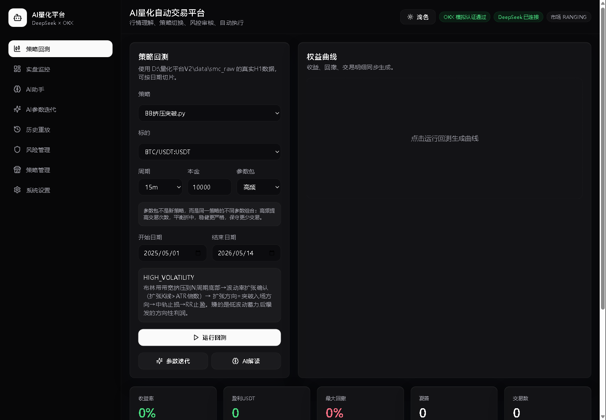
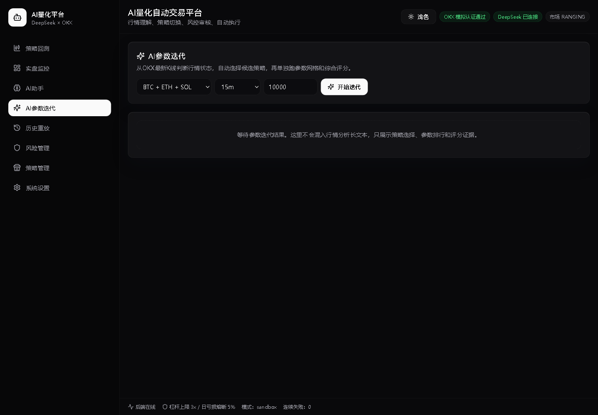
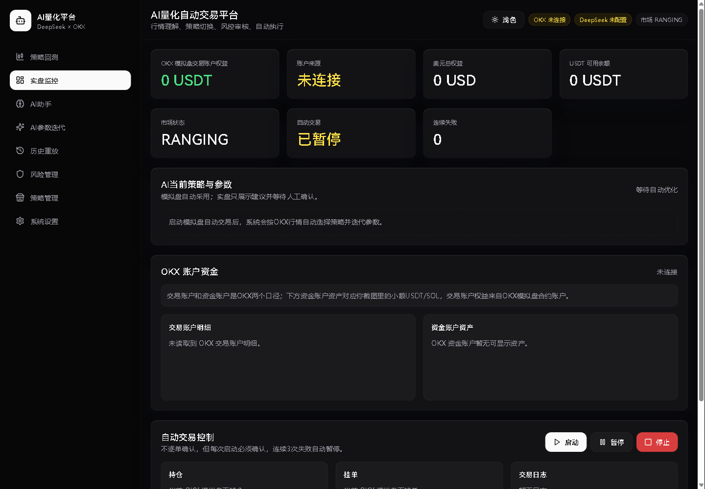
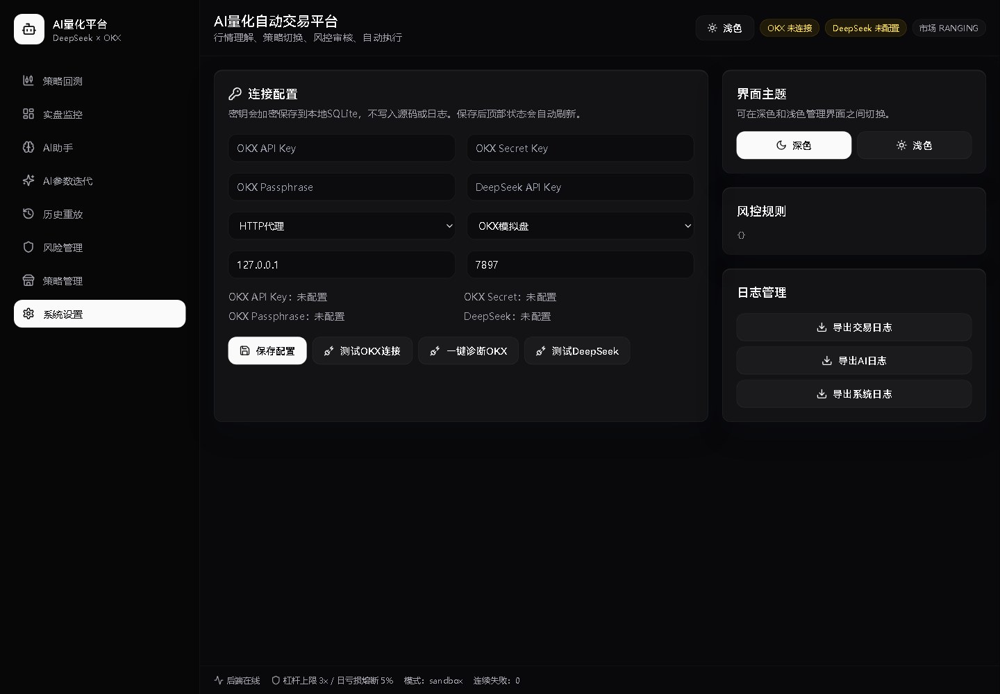

# AI 量化自动交易平台

本项目是本地运行的 OKX 加密货币 AI 量化平台。DeepSeek 负责行情理解，四个通过质检的策略负责信号，风控守卫负责所有下单前硬约束。当前版本已经接入 OKX 实时行情、OKX 模拟盘账户/持仓/挂单读取、DefiLlama 链上 TVL 摘要、DeepSeek 综合分析、策略回测/参数迭代和 OKX 模拟盘测试下单。

## 当前状态

这是一个可运行的单 Agent 自适应量化执行系统：

```text
市场感知 -> AI 决策 -> 策略切换 -> 参数自适应 -> 模拟盘执行 -> 风控保护
```

当前重点能力：

- 真实行情：读取 OKX 公共 ticker 和 K 线，覆盖 BTC/ETH/SOL USDT 永续。
- 链上数据：读取 DefiLlama 的 Bitcoin、Ethereum、Solana 链上 TVL 摘要。
- AI 综合分析：DeepSeek 会同时接收 OKX K 线结构、OKX 实时 ticker、链上 TVL、账户权益和持仓数量。
- 策略自适应：系统通过 `classify_market()` 判断趋势、震荡、高波动、趋势衰竭等状态，再选择适配策略。
- 参数自适应：策略被选中后，会搜索近期更合适的参数，降低固定参数在市场切换后的失效风险。
- OKX 模拟盘测试下单：实时监控页提供“测试下单”按钮，可向 OKX 模拟盘发送 `SOL-USDT-SWAP` 市价买入 1 张测试单，并刷新持仓。
- 安全边界：测试下单仅允许 sandbox 模式；实盘仍只展示建议，实盘自动执行需要额外确认、仓位和审计流程。

## 解决的问题

| 传统量化痛点 | 本平台的解决方式 |
| --- | --- |
| 静态策略无法适应市场变化 | AI 实时判断市场状态，动态切换策略 |
| 固定参数在新行情中失效 | 策略激活时自动用近期数据优化参数 |
| 人工交易受情绪影响 | 以风控和流程约束模拟盘执行 |
| 单策略风险集中 | 四种策略覆盖不同市场状态 |
| 策略失效无感知 | 切换和参数迭代基于最新市场数据评估 |

当前仍是单 Agent 架构，策略池固定为 4 个策略。后续可以继续进化为多 Agent 策略生态管理，例如因子挖掘、独立质检、策略退役和生命周期管理。

## 功能预览

| 策略回测 | AI 参数迭代 |
| --- | --- |
|  |  |

| 实时监控 | 系统设置 |
| --- | --- |
|  |  |

## 快速启动

### 方式一：源码启动

1. 安装后端依赖：

   ```bash
   cd backend
   pip install -r requirements.txt
   ```

2. 安装前端依赖：

   ```bash
   cd frontend
   npm install
   ```

3. 回到项目根目录，双击 `start.bat`，或运行：

   ```bash
   ./start.sh
   ```

4. 打开：

   ```text
   http://127.0.0.1:5173
   ```

### 方式二：Windows EXE

Release 包会提供 `AIQuantPlatform.exe`。双击后会启动本地服务并打开浏览器：

```text
http://127.0.0.1:8000
```

如果 8000 端口已被占用，启动器会自动尝试 8001、8002 等后续端口，并打开正确地址。EXE 使用打包好的前端静态文件，不需要单独启动 Vite。

## 配置

在“系统设置”页填写：

- OKX API Key
- OKX Secret Key
- OKX Passphrase
- DeepSeek API Key
- 代理设置：如果当前网络需要代理，填写本机代理；如果新电脑可以直连，选择“不使用代理”。
- 市场模式：默认 `OKX 模拟盘`

密钥只会加密保存到本地 SQLite，不写入源码、README、前端缓存或日志。

## DeepSeek 模型

当前默认模型：

- 主模型：`deepseek-v4-pro`
- 快速模型：`deepseek-v4-flash`

接口会优先访问 `https://api.deepseek.com`，失败时尝试 `https://api.deepseek.com/v1`。

## AI 分析数据口径

AI 分析会收到以下数据：

- `market_data`：OKX 最新 K 线快照，用于趋势、波动率、ATR、布林带宽度等结构判断。
- `live_tickers`：OKX 实时 ticker，包括最新价、24h 涨跌、成交额、bid/ask、更新时间。
- `onchain_summary`：DefiLlama 链上摘要，包括 Bitcoin/Ethereum/Solana 的 TVL、链名、来源和更新时间。
- `okx_account`：OKX 账户权益、资金账户资产等摘要。
- `okx_positions_count`：当前持仓数量。
- `auto_optimization`：自动策略选择和参数迭代结果。

## 模拟盘测试下单

实时监控页提供“测试下单”按钮：

```text
SOL-USDT-SWAP
side: buy
ordType: market
sz: 1
tdMode: cross
```

后端会强制检查：

- 仅允许 `market_mode=sandbox`
- 仅允许 BTC/ETH/SOL 的 USDT 永续
- 必须传入 `confirm=true`
- 不会在实盘模式执行

## 策略与数据

策略目录只允许以下四个文件参与加载：

- `BB挤压突破.py`
- `BOS移动止损增强版.py`
- `摆动点区间反转.py`
- `趋势衰竭反转.py`

回测优先读取 `backend/data_cache/market_data/` 下的 BTC/ETH/SOL CSV；如果不存在，会尝试读取外部历史目录；再失败则使用确定性的合成数据保证页面可启动。

## 风控硬规则

- 最大杠杆默认 3x
- 单日亏损 5% 熔断
- ATR 异常波动熔断
- 最小名义仓位 10 USDT
- 策略切换冷却期 12 小时
- 连续 3 次下单失败自动暂停自动交易

## 测试

后端：

```bash
cd backend
pytest
```

前端：

```bash
cd frontend
npm run test
npm run build
```

## 发布打包

Windows EXE 打包流程：

```bash
cd frontend
npm run build

cd ..
pyinstaller packaging/windows_launcher.spec --clean --noconfirm
```

产物位于：

```text
dist/AIQuantPlatform/AIQuantPlatform.exe
```

## 安全说明

- 默认市场模式是 OKX 模拟盘。
- 测试下单会真实调用 OKX 模拟盘 REST，但不会触发实盘资金。
- 当前自动交易循环仍保持保守边界；实盘自动执行需要另行增加更严格的确认、仓位和审计流程。
- 不要把 `backend/data_cache/quant_platform.sqlite3`、`.secret.key` 或任何 API Key 上传到 GitHub。
